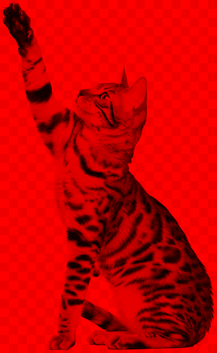
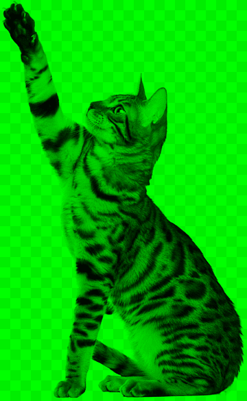
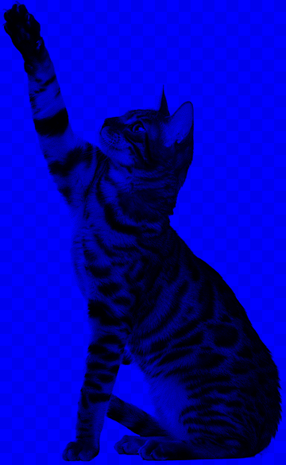
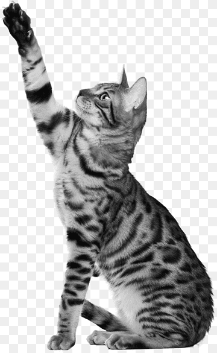
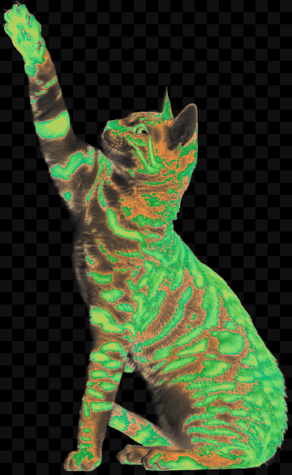
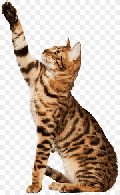

# Лабораторная работа №1.  Цветовые модели и  передискретизация изображений

### Исходное изображение:

### Изображение по красному каналу:

### Изображение по зеленому каналу:

### Изображение по синему каналу:

### Изображение HSI:

### Инвертированное изображение:

### Растяжение в 2 раза:

### Сжатие в 3 раза:

### Передискретизация в К = М/N раз (M = 2, N = 3) через растяжение и последующее сжатие:

### Передискретизация в К раз за один проход:

