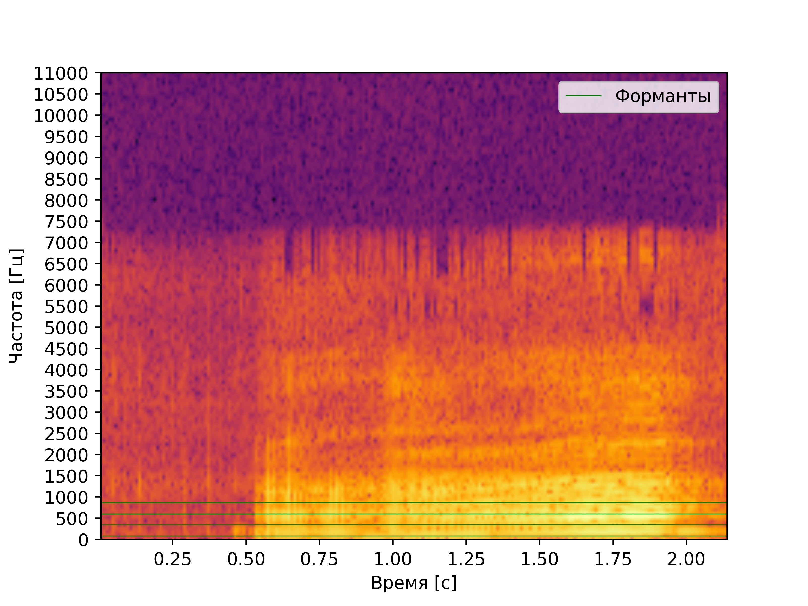
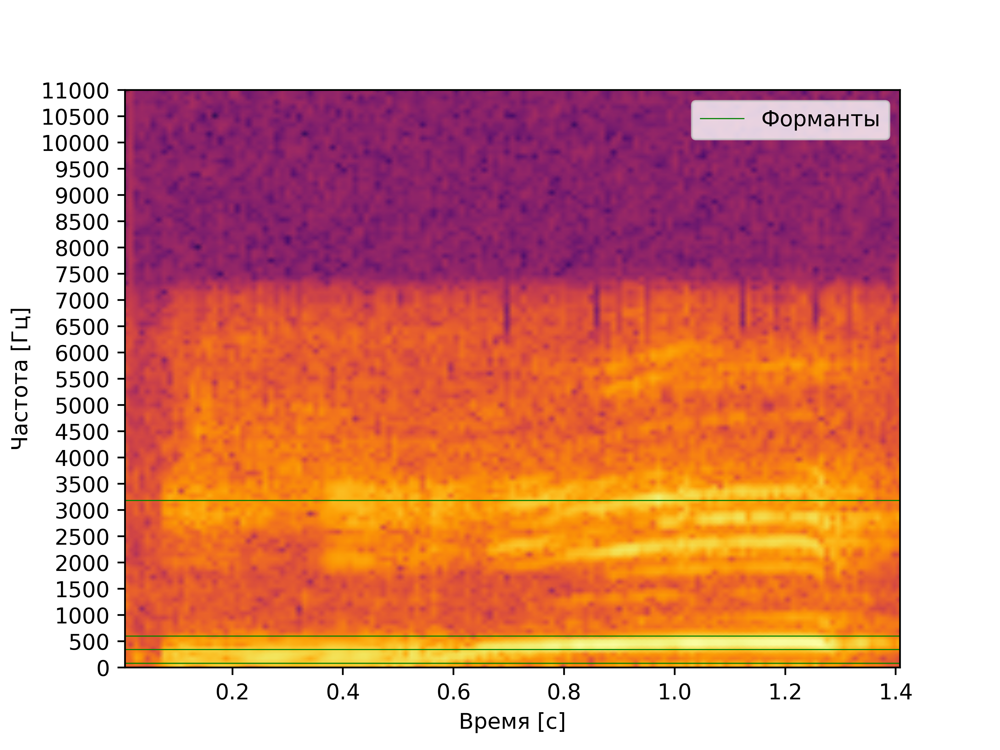
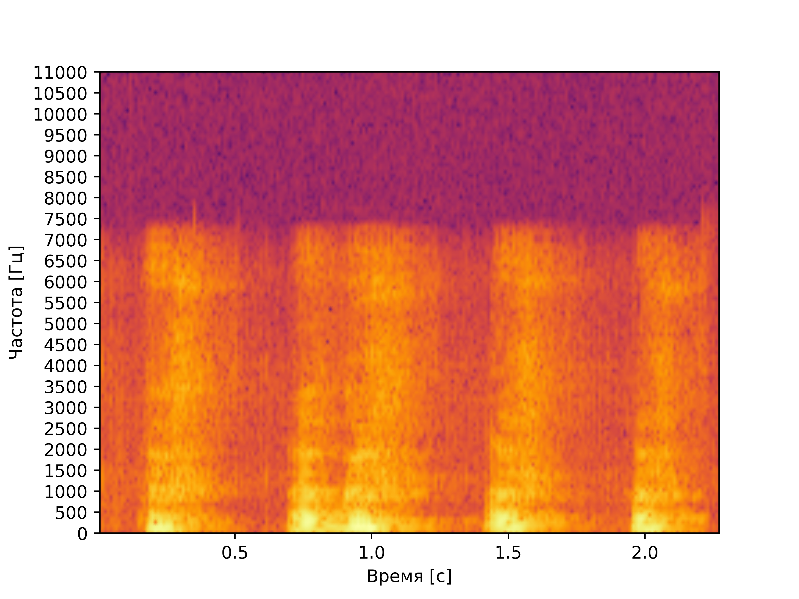

# Лабораторная работа №10. Обработка голоса
- Определение примерных минимальной и максимальной частот голоса
- Поиск тембрально окрашенного тона
- Поиск самых сильных формант

## Спектрограмма записи звука "А" по наростающей

## Анализ
**Основной тон:** примерно 86 Гц

**Форманты:** форманта **FI** - 86 Гц,
**FII** - 344 Гц,
**FIII** - 602 Гц, 
**FIV** - 861 Гц

**Максимальная частоста:** 3186 Гц

## Спектрограмма записи звука "И" по наростающей

### Анализ
**Основной тон:** примерно 86 Гц

**Форманты:** основная форманта **FI** - 86 Гц, 
**FII** - 344 Гц, 
**FIII** - 602 Гц,
**FIV** - 3186 Гц

**Максимальная частоста:** 3186 Гц

## Спектрограмма записи лая

**Максимальная частоста:** 3531 Гц

## Выводы

При сравнении спектрограмм звуков "И" и "А" можно увидеть, что у второй значительная часть переносящих основную энергию формант сосредоточена в диапазоне 86 --- 1120 Гц. У первой же перенос энергии происходит как на низких частотах (344 --- 602) Гц, так и на средних (см форманту **FIV** 1894 Гц)