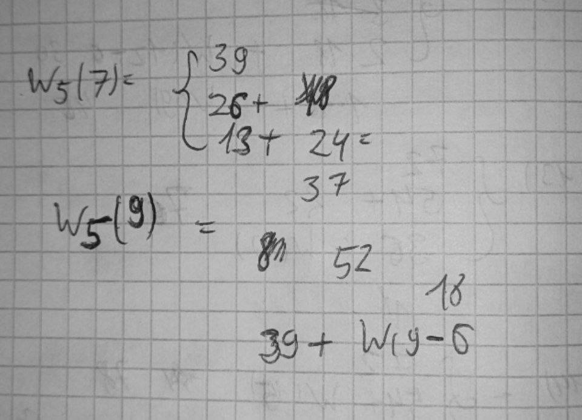
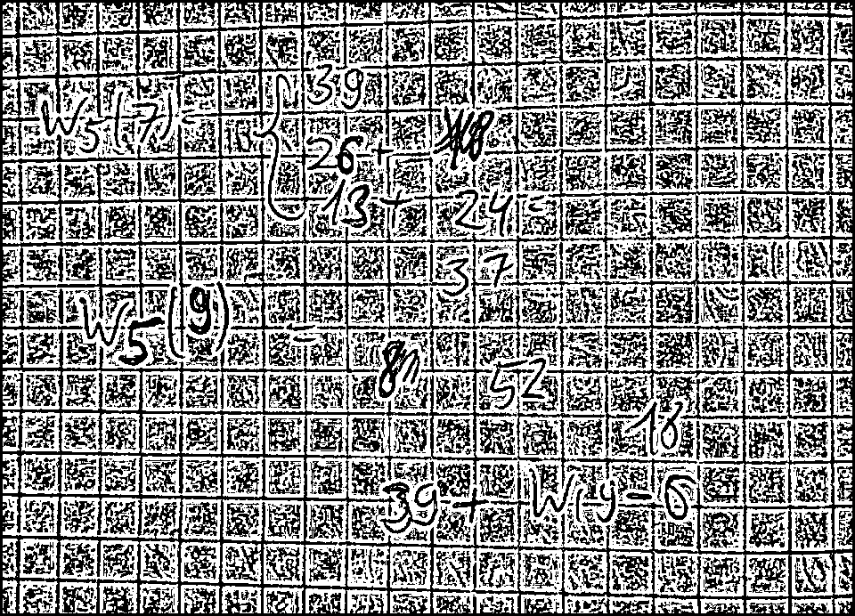
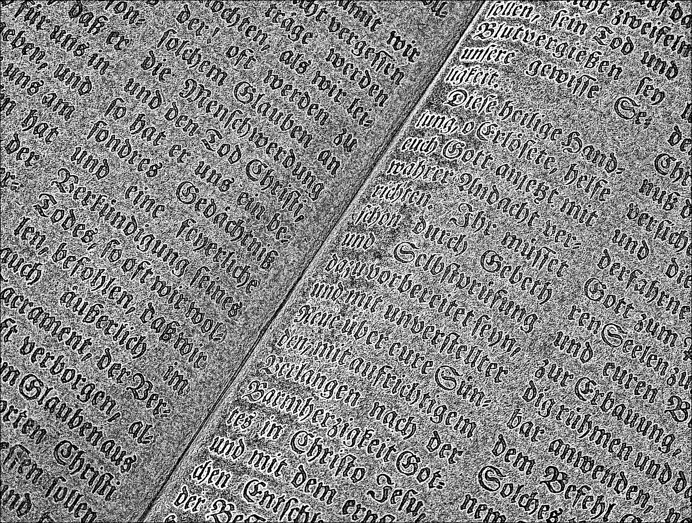

# Лабораторная работа №2. Обесцвечивание и бинаризация растровых изображений

## Описание задания

### 1. Приведение полноцветного изображения к полутоновому Новое изображение создаётся в режиме полутона (1 яркостный канал, формат bmp), где яркость каждого пикселя вычисляется (взвешенным) усреднением каналов исходного полноцветного изображения.

L = 0.3 * R + 0.59 * G + 0.11 * B

### Исходные изображения

 

### Полутоновые изображения 

 

### 2. Приведение полутонового изображения к монохромному методом пороговой обработки
#### Вариант: Адаптивное монохромное преобразование с усреднением по минимаксу(окно 7*7) 

threshold = (min_val + max_val) / 2

  