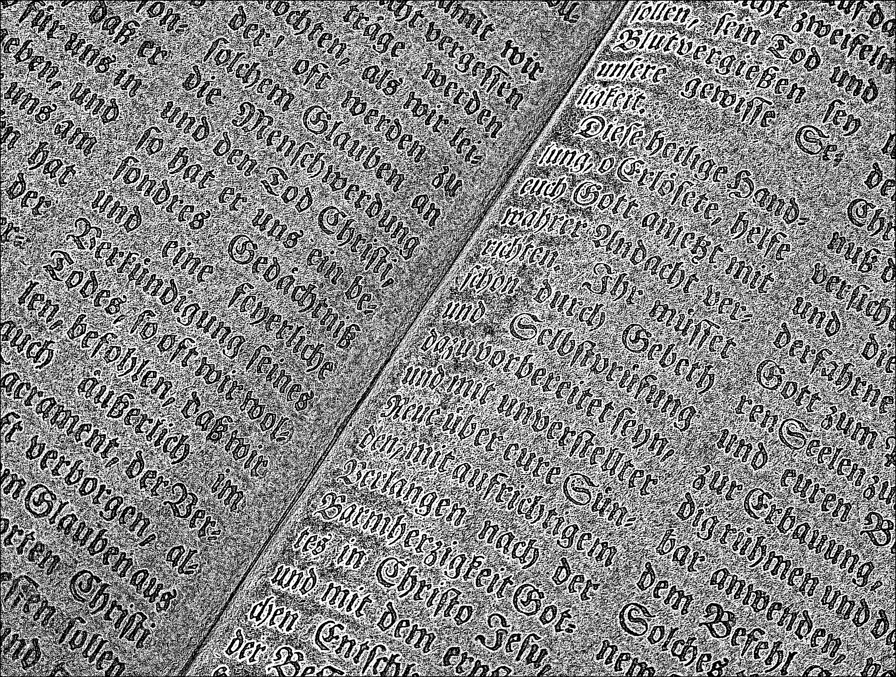
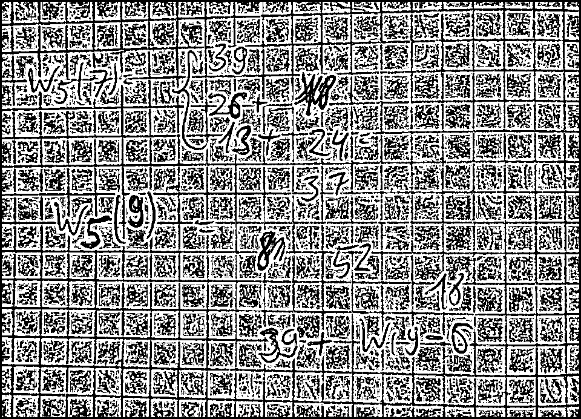
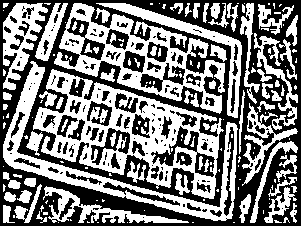
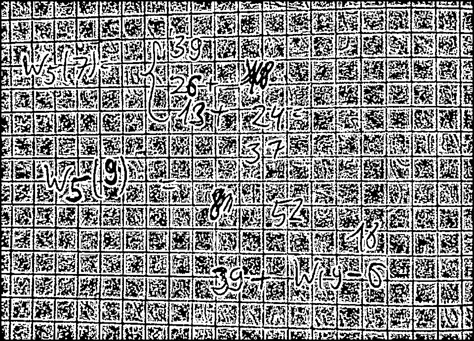
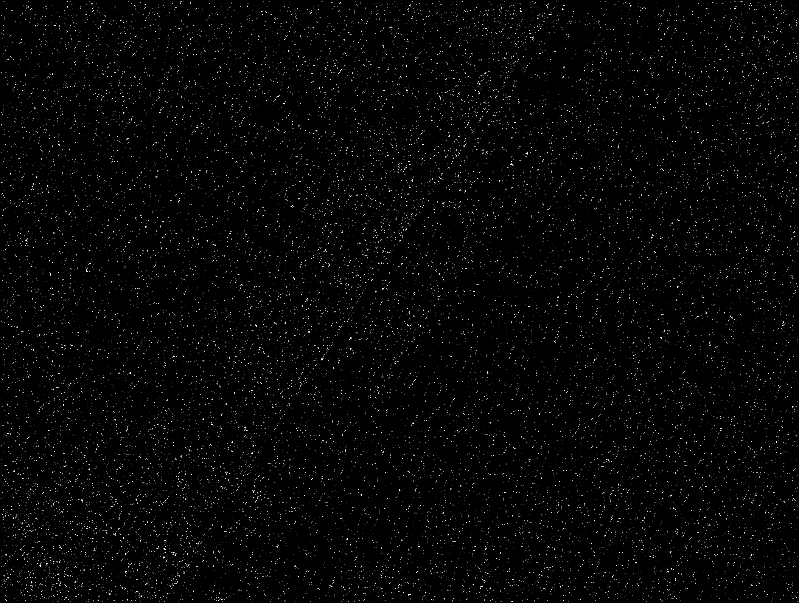
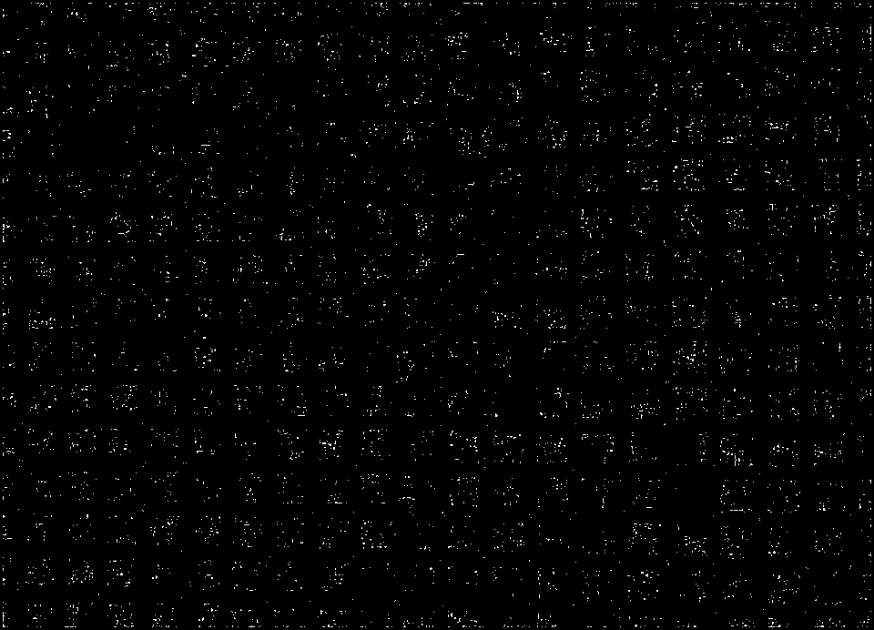
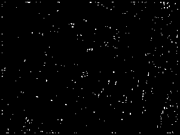

# Лабораторная работа №3. Фильтрация изображений и морфологические операции

## Описание задания: В качестве входных данных берётся монохромное (или полутоновое, где уместно) изображение (несколько штук). В качестве выходных данных демонстрируется: 

### 1. Отфильтрованное монохромное (полутоновое) изображение 

### Исходные изображения

  

### Отфильтрованные изображения

  

### 2. Разностное изображение 

  

