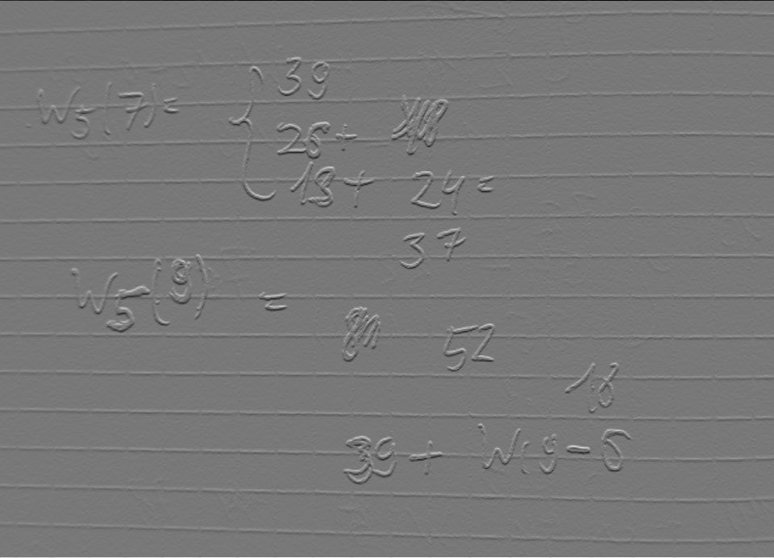

#  Лабораторная работа №4. Выделение контуров на изображении

## Описание задания:  В качестве входных данных берётся цветное или полутоновое изображение. Цветное изображение сводится к полутоновому. 

## Вариант: Оператор Шарра 3*3

### Исходное изображение

### Градиетная матрица Gx

### Градиетная матрица Gy

### Градиетная матрица G

### Градиетная матрица G c порогом 100

