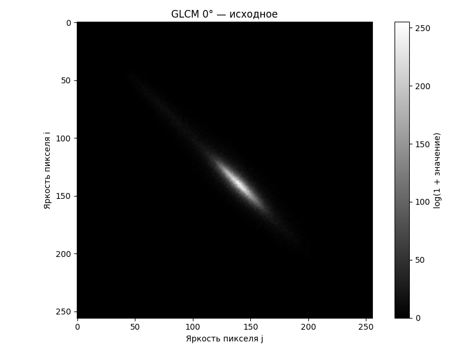
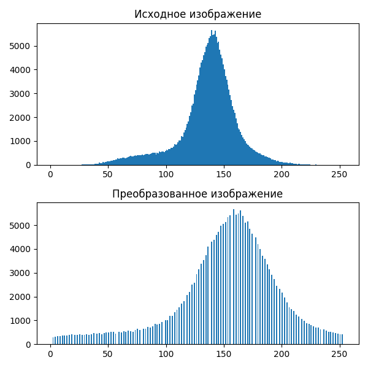
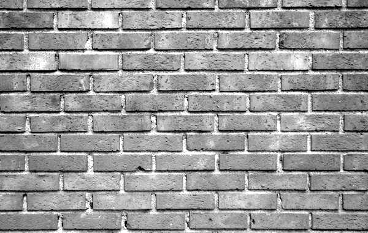
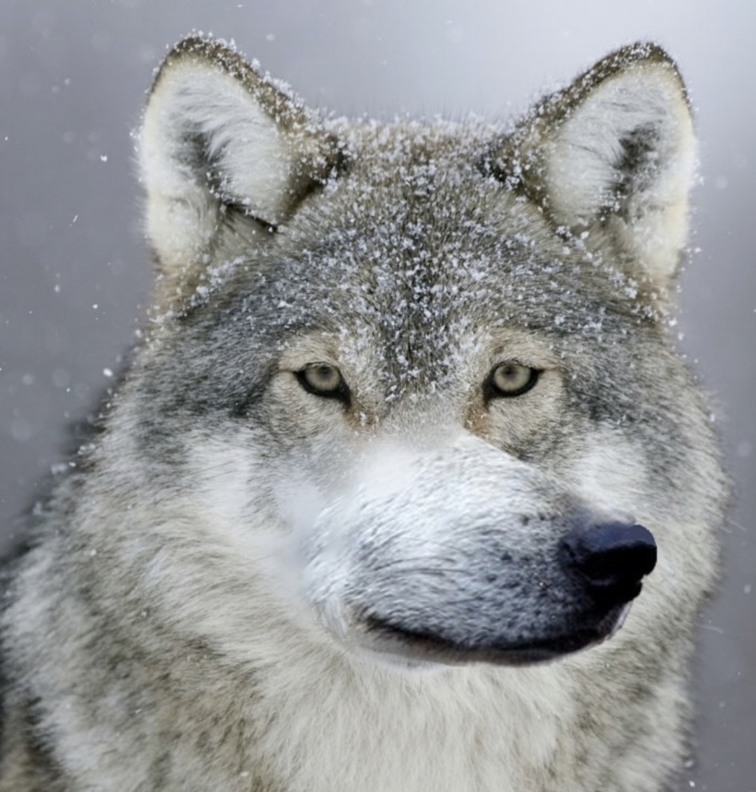
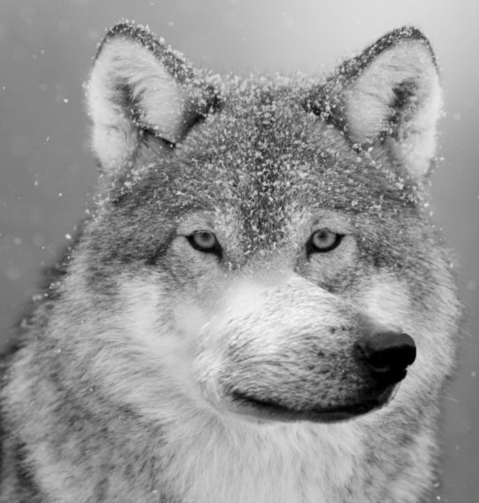
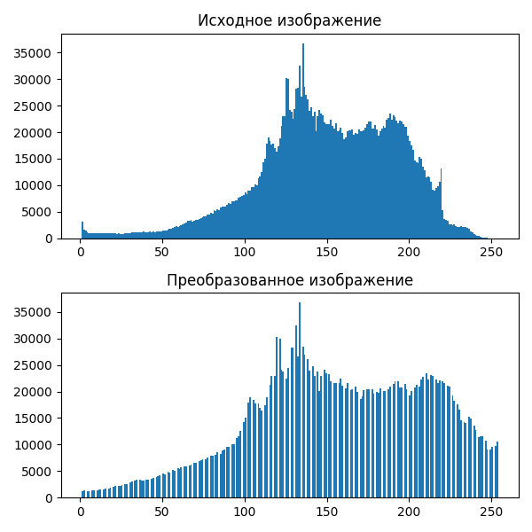
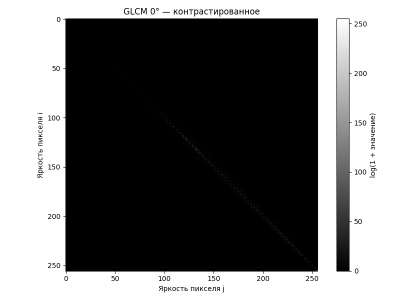

# Лабораторная работа №8. Текстурный анализ и контрастирование.
- Матрица длин серий (GLСM)
- Расчет признаков CORR 
- Степенное контрастирование
- Матрицы длин серий(логарифмической нормировки) для полутоновых и контрастированных полутоновых изображений

##  Изображение кирпичной стены 
### Исходное:

### Полутоновое:

### Матрица длин серий

### Признаки
--- Направление 0° ---
CORR: 0.92
### Гистограммы

### Констрастированное полутоновое изображение

### Матрица длин серий для контрастированного изображения

### Контрастированные признаки

--- Направление 0° ---
CORR: 0.92
##  Изображение волка
### Исходное:

### Полутоновое:

### Матрица длин серий

### Признаки
--- Направление 0° ---
CORR: 1.00

### Гистограммы

### Констрастированное полутоновое изображение 

### Матрица длин серий для контрастированного изображения

### Контрастированные признаки
--- Направление 0° ---
CORR: 0.99

## Выводы
нтрастирование (степенное преобразование) значительно усиливает текстуры, особенно в областях с низкой контрастностью. При этом текстурный признак корреляции (CORR) уменьшается, что указывает на снижение линейной зависимости между яркостями соседних пикселей. Матрица совместной встречаемости (GLCM) становится более разреженной, что подтверждает увеличение разнообразия яркостей после контрастирования. Результаты зависят от направления текстур: для горизонтальных текстур (угол 0°) изменения могут быть более выраженными, чем для вертикальных (угол 90°). 
